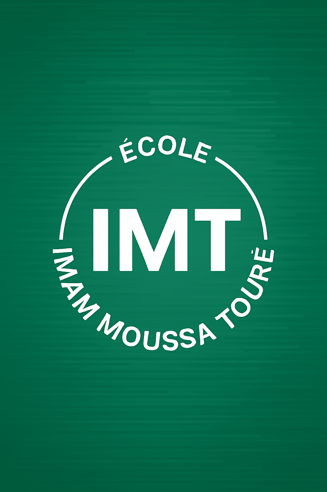

# Ecole Imam Moussa Touré

A modern, responsive website for the school "Ecole Imam Moussa Touré" in Senegal. This site provides information about the school, its classes, administration, and students.

---

## 📸 Screenshots


*Homepage preview*

---

## ✨ Features
- Beautiful, responsive design for all devices
- Home page with school introduction and contact info
- Class pages with dynamic student lists
- Administration and about pages
- Image and video galleries
- Easy navigation and user-friendly interface

---

## 📁 Folder Structure
```
school/
├── index.html                # Main homepage
├── style.css                 # Main stylesheet
├── index.js                  # Main JavaScript for navigation
├── photo.png, logo*.png, ... # Images and logos
├── image/                    # Additional images and videos
│   └── video/                # School videos
├── sideProject/
│   ├── about/                # About page (HTML, CSS)
│   ├── Administration/       # Admin page and staff images
│   ├── classe/               # Class pages and styles
│   ├── info/                 # Info page
│   └── script.js             # JS for side project pages
└── README.md                 # This file
```

---

## 🚀 How to Run
1. **Clone the repository:**
   ```bash
   git clone <your-repo-url>
   cd school
   ```
2. **Open `index.html` in your browser.**
   - No build step is required; this is a static site.
   - For best results, use a modern browser (Chrome, Firefox, Edge).

---

## 🤝 Contributing
We welcome contributions!
- Fork the repository and create a new branch for your feature or fix.
- Make your changes and test locally.
- Commit with clear messages and open a pull request.
- For major changes, please open an issue first to discuss what you would like to change.

---

## ❓ FAQ
**Q: Can I use this project for another school?**
- Yes! Feel free to fork and adapt it for your needs.

**Q: How do I add a new class or student?**
- Edit the relevant HTML file in `sideProject/classe/` and update the student list.

**Q: Who do I contact for support?**
- Email: dialloschool@school.com

---

## 🏆 Credits
- Project by the Ecole Imam Moussa Touré team.
- Images and content © Ecole Imam Moussa Touré.
